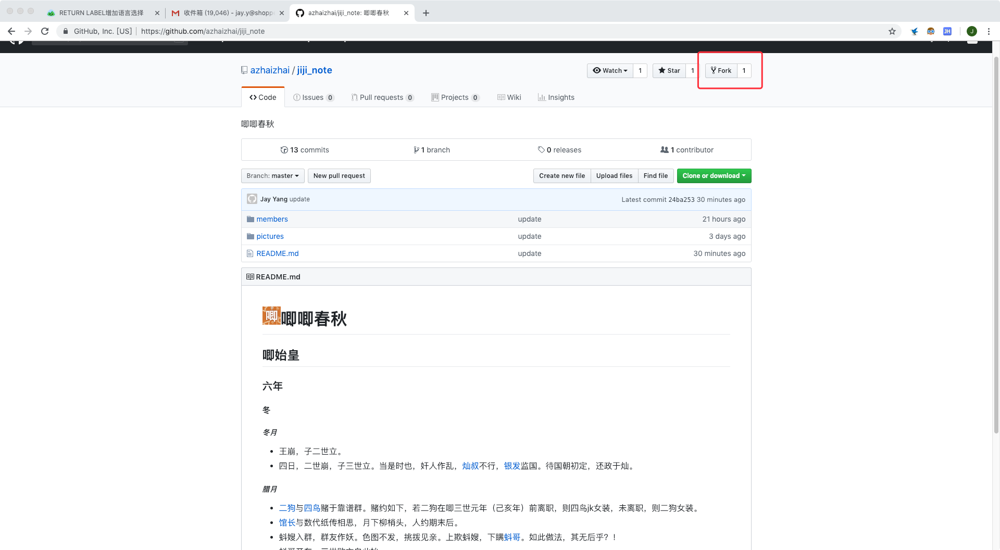
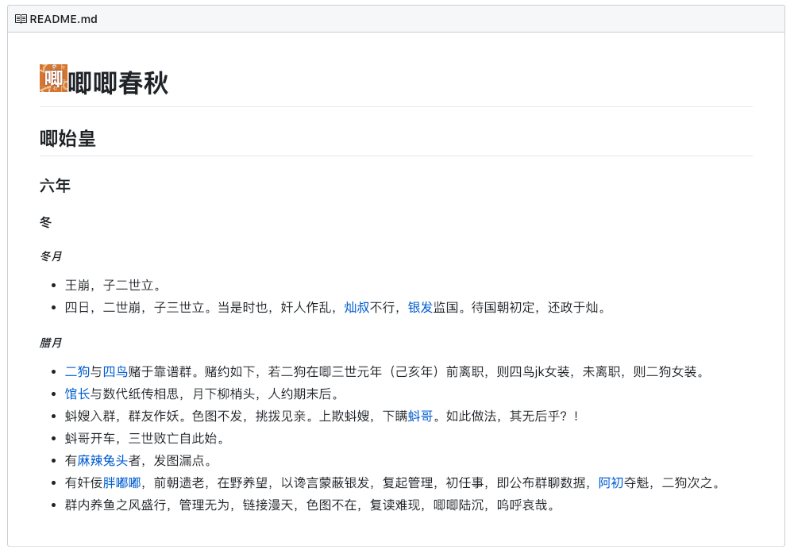
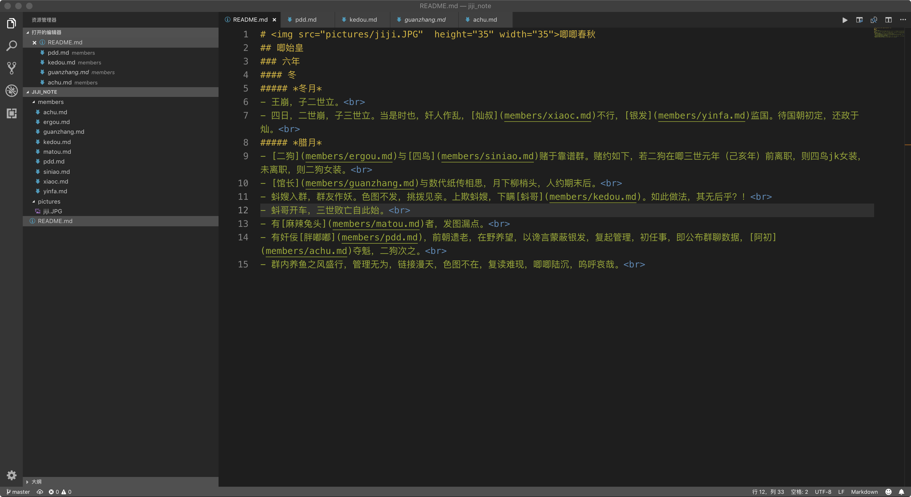
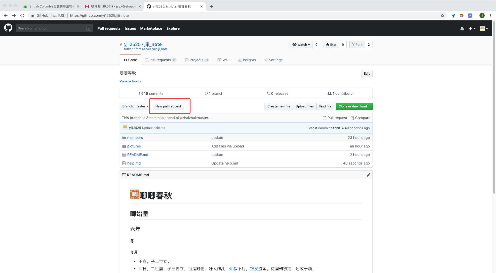
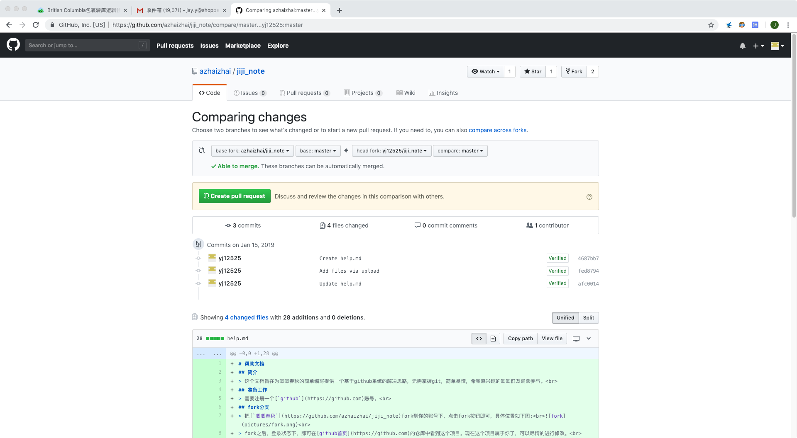

# 帮助文档
## 简介
> 这个文档旨在为唧唧春秋的简单编写提供一个基于github系统的解决思路，无需掌握git，简单易懂，希望感兴趣的唧唧群友踊跃参与。 
## 准备工作
> 需要注册一个[`github`](https://github.com)账号。 
## fork分支
> 把[`唧唧春秋`](https://github.com/azhaizhai/jiji_note)fork到你的账号下，点击fork按钮即可，具体位置如下图:  
> fork之后，登录状态下，即可在[github首页](https://github.com)的仓库中看到这个项目。现在这个项目属于你了，可以尽情的进行修改。 
## markdown编辑
> 所谓`唧唧春秋`本体，也就是项目里的README.md文件，使用markdown语法编辑，如果需要修改，点击README.md，找到edit选项，即可进行修改，其他各人传记也类似。 
> markdown是什么不再赘述，感兴趣请查阅wiki:[`markdown`](https://en.wikipedia.org/wiki/Markdown)，这里只简单说下语法。 
> 通过图片来讲解:  
> 这是当前的`唧唧春秋`内容，它的源码如下:  
- 第一行:`# 唧唧春秋`
  - 这行源码 `# `代表标题，即字号更大，粗体且会自动添加锚点。例如我访问[https://github.com/azhaizhai/jiji_note/blob/master/README.md#%E8%85%8A%E6%9C%88](https://github.com/azhaizhai/jiji_note/blob/master/README.md#%E8%85%8A%E6%9C%88) 就会自动定位到第一行。 
  - 下来的``的内容，是html标签，引用了一张图片(`src="pictures/jiji.JPG"`)，这个图片存储在项目的`pictures`文件夹内，因为原图较大，所以对大小进行了限制，限制其高(`height="35"`)和宽（`width="35"`）为35px。如果是大小合适的图片，只需要用md语法``进行引用即可。如，在此使用``引用唧唧群头像，效果如下: 
  -  
  - 在后面的`唧唧春秋`，即为你要写的内容，不再赘述。 
- 二至三行，与第一行`#`类似，`#`数量多则代表次级标题。
- 第四行，`##### *冬月*`
  - 前面与第一行类似，为标题，后面`*内容*`，观察原文可知，用一个`*`号括起来的内容为斜体。除此之外，如果是`**内容**`，则为粗体，效果如下:**内容**
- 第五行， `- [二狗](members/liezhuan.md#二狗)与[四鸟](members/liezhuan.md#四鸟)赌于靠谱群。赌约如下，若二狗在唧三世元年（己亥年）前离职，则四鸟jk女装，未离职，则二狗女装。 `
  - `- `代表列表，即通过条目呈现内容。添加退格即可成为次级列表。
  - `[二狗](members/liezhuan.md#二狗)`此处为二狗添加超链接指向了二狗的个人传记，用法与图片类似，`[内容](链接或项目内相对路径)`，如`[百度](https://baidu.com)`效果如下:[百度](https://baidu.com)。后面的四鸟类似.
  - ` `为换号，因为标题自带换号，所以不需要换行符，正文内容则需要换行符。
- 暂时就用了这么多内容，想自己搞点骚操作的，可以查看github的[markdown](https://guides.github.com/features/mastering-markdown/)语法。
## 新建及上传
- 点击create或者upload即可，要在哪个文件夹新建或上传，就点进那个文件夹进行相应操作即可。
## 将你的项目合并到主项目
- 等你的修改工作完成之后，确认修改。然后就需要将你的修改内容提交到主项目方便所有人看到。在你的项目页，点击pull request按钮，如图所示: 
 
- 会进入merge request页面，通常来讲都是没什么问题的，直接点击create pull requset按钮即可，如果有冲突的话。。。等你遇到再私聊我(江叶)吧。。。 
 
- 点击完后，去群里喊我merge你的更改，如果我确认你没有搞事的话（诸如大面积删除其他人的工作），我就会将你的内容合进主分支，这样所有人都能看到你的修改啦！
